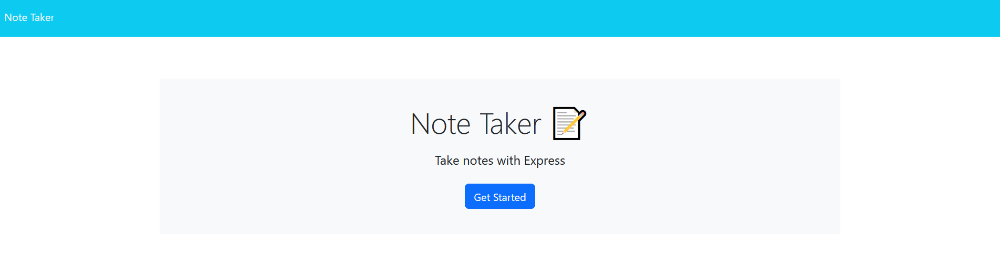
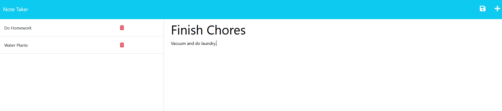
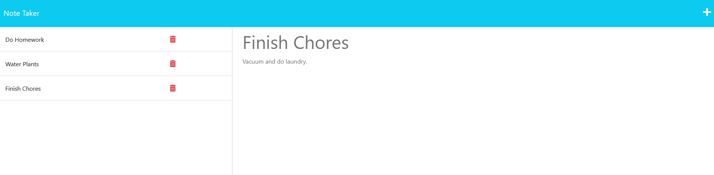

# brandon-express-note-taker

[Link to live deploy on Heroku]()

## Table of contents

- [Description](#description)
- [Installation](#installation)
- [Usage](#usage)
- [License](#license)
- [Questions](#questions)

## Description

As a full stack developer, being able to link front end and back end pages is important. This application is for creating, viewing, and deleting notes. The front end code was given to us, and we had to link it to the back end using GET, ROUTE, and DELETE requests. The servers mainly used Express.js as well as Node.js to create a modular and readable experience. The uuid npm package was also used in order to create unique id's that can be traced back to specific notes. I learned a lot about how routes work/connect, and how to organize when having both front end and back end files. The biggest challenge was creating the DELETE route functionality, as it wasn't something we had gone over before. It ended up having a similar structure to the other route requests, and required the asynchronous version of the readFile function.

## Installation

This application doesn't need to be installed since it is deployed on Heroku. However if you would like to see the code used for the project, the instructions for installation are below.

1. Clone the repository from GitHub.
2. Install or have `Node.js` installed.
3. Open the cloned repository in VSCode.
4. Open the project inside the integrated terminal.
5. Install all package dependencies using `npm i`
6. Install modules `uuid` and `express` using the `npm i uuid` and `npm i express` commands.

## Usage

There are a few main features, mainly adding saving and deleting notes. For the most part the application is straightforward and easy to understand.

1. After following the installation steps, run the command `node server.js` in the terminal.
2. A message will appear in the terminal with a link to a local server under http://localhost:3001.
3. `Ctrl + Click` on the link to open the application in a web browser.
4. There will be a home page with a blue `Get Started` button.
5. Clicking that button will bring you to the notes page, where you can see a couple example notes on the left hand side.
6. Any of the notes can be clicked on to see their descriptions.
7. To create a new note, click the `plus` at the top right hand corner of the screen if you are already in a note. (Otherwise you can just start typing a note title and text into the text boxes.)
8. After filling in title and description boxes, click the `save` icon in the top right next to the `plus`.
9. The note will then be added at the bottom of the list under the previous existing notes.
10. To delete any note, click the `red trash can` icon to remove it from the list.

### Example Home Page

### Example Creating Note Page

### Example Created Note

## License

Licensed using [MIT](https://opensource.org/license/mit/)

## Questions

You are welcome to contact me with questions using the following:

- [GitHub Profile](https://github.com/bwing2)

- [Email](mailto:brandon.wing245@gmail.com)
